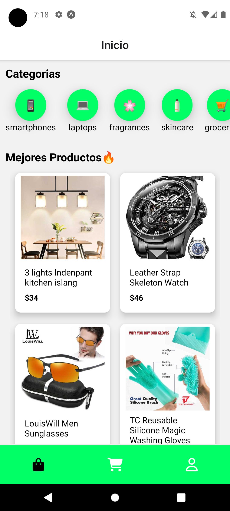
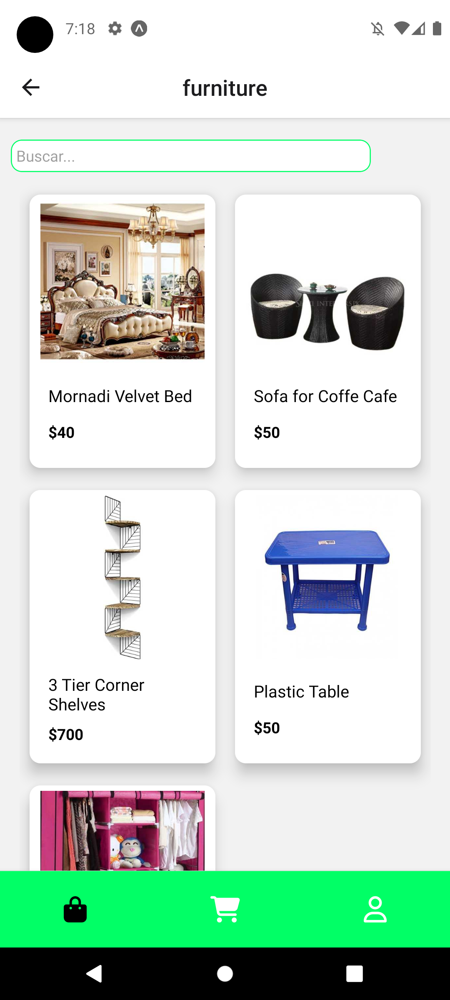
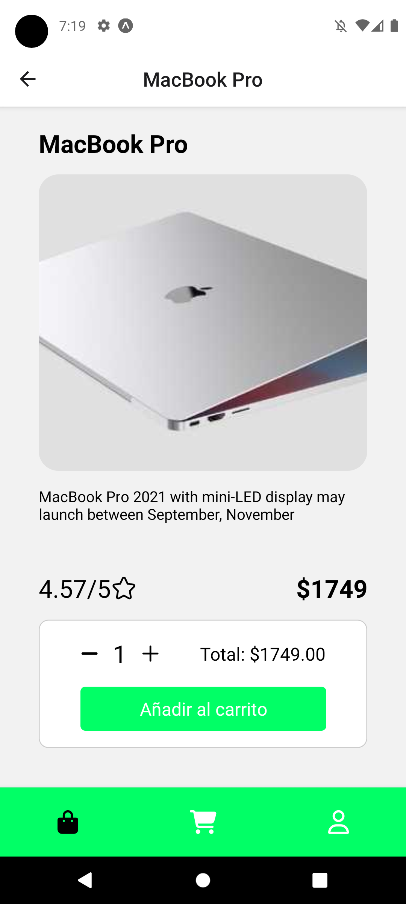
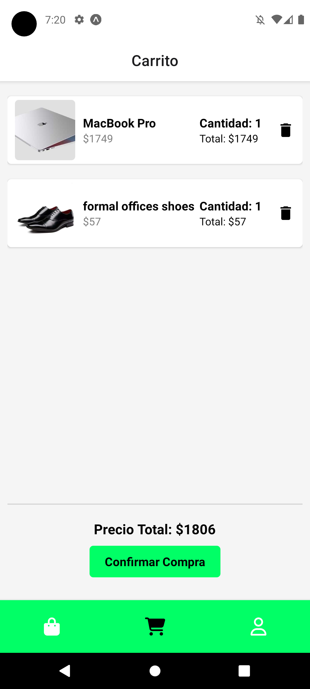
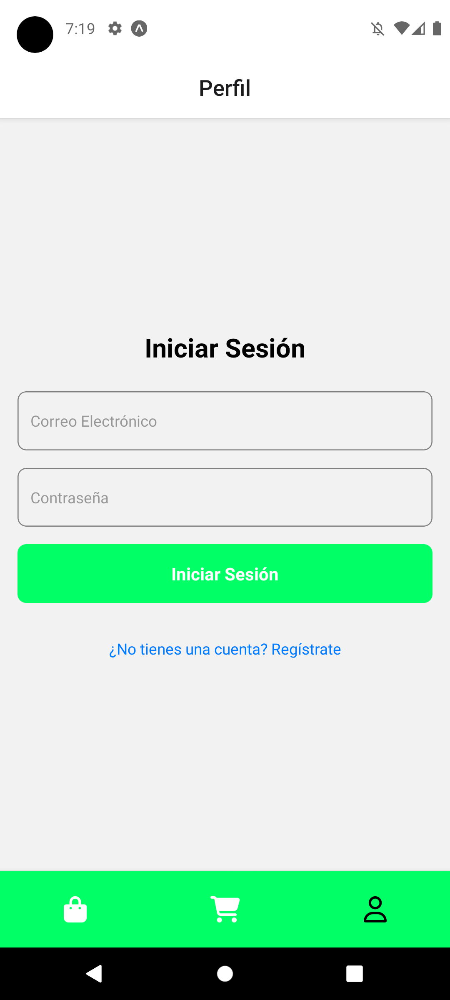
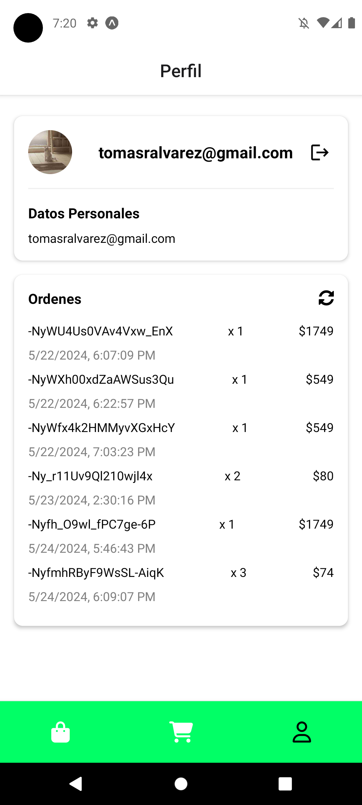

# Ecommerce APP

## Descripción general

Esta App hecha con React Native fue realizada por Tomás Álvarez para el curso de Desarrollo de Aplicaciones de Coderhouse.

EcommerceApp es una aplicación donde se simula todo el flujo real de un ecommerce: navegación por variadas categorías y productos, sección de mejores productos, agregado de productos a un carrito y confirmación de compra. Registro de usuarios y personalización de los mismos utilizando los sensores/periféricos del dispositivo, sin bloquear la vista de los productos para una mejor experiencia.

## Herramientas Principales

- React Native
- Expo
- Android Simulator
- Firebase Realtime Database
- Firebase Authentication

## Paquetes Instalados y su uso

- Navegación (Stack Navigator)

  - npm i @react-navigation/native
  - npm i react-native-screens
  - npm i react-native-safe-area-context
  - npm i @react-navigation/native-stack
  - npm i @react-navigation/bottom-tabs

  Stack Navigator permite apilar las screens por las que vamos navegando, quedando arriba siempre la última screen vista. Esto facilita la navegación dentro de la app.

- State & Redux

  - npm i @reduxjs/toolkit react-redux
  - npm i --save-dev @redux-devtools/core

  State & Redux simplifican la gestión de datos para su utilización en diversos componentes los cuales reaccionarán o manejarán los cambios de estado.

- Cámara

  - npx expo i expo-image-picker
  - npx expo i expo-file-system

  Utiliza la cámara y/o la galería de fotos del dispositivo para personalizar la foto de perfil del usuario logueado.

- SQLite

  - npm i expo-sqlite

  SQLite es una herramienta de Expo que nos permitirá crear persistencia de datos en nuestra aplicación. Esto significa que cuando la aplicación se cierre, permanecerán los datos seleccionados, como por ejemplo: el usuario logueado.

## Screenshots

    
    
    
    
    
    

